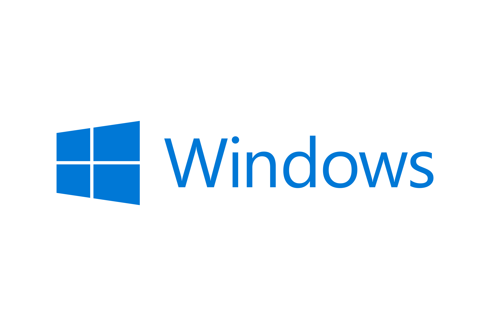
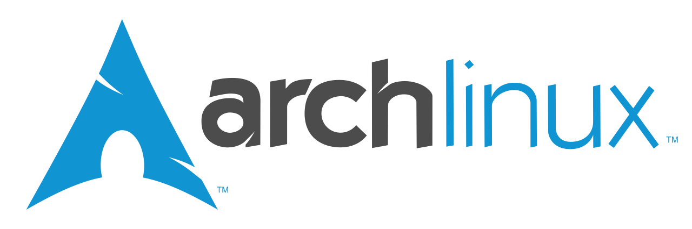

# ¿Qué es un sistema operativo?

> Un sistema operativo (SO) es un conjunto de programas informáticos que gestionan el hardware y las aplicaciones de un ordenador asignado recursos, como la memora, la CPU, los dispositivos de entrada/salida y el almacenamiento de archivos.

Todos los sistemas informáticos, desde los ordenadores hasta los dispositivos móviles, necesitan al menos un sistema operativo para realizar tareas, como abrir un documento, buscar por internet o crear archivos y carpetas.

Los SO se dividen en componentes, cada uno especializado en una función concreta, algunos serían:
### Interfaz de usuario
La interfaz de usuario es el aspecto gráfico del sistema, que emplea el usuario para interactuar con el hardware
### Gestor de procesos
El gestor de procesos permite a los programas interactuar con el hardware del ordenador.
### Dispositivos de entrada/salida
El gestor de estos dispositivos se encarga de registrar las acciones del usuario mediante los periféricos y los componentes integrados.
### Sistema de archivos
El sistema de archivos gestiona las operaciones realizadas sobre los archivos, es decir, nos permite crear, modificar y eliminar tanto archivos[^1] como directorios[^2]
### ¿Qué tienen en común estos componentes?
- Ayudan al usuario
- Controlan y protegen el sistema
- Gestionan los recursos del sistema
## Tipos de SO
Los sistemas operativos pueden clasificarse en función de sus características, funciones y compatibilidad con otras aplicaciones o componentes de hardware/software.
    - Usuarios (mono/multiusuario)
    	- Permite trabajar a un usuario
    	- Permite trabajar a varios usuarios
    - Tareas (mono/multitarea)
    	- Solo ejecuta un programa a la vez
    	- Ejecuta varios programas a la vez
    - Procesadores (Uniprocesador/Multiprocesador)
    	- Utiliza solo un procesador
    	- Utiliza varios procesadores
    - Interfaz (CLI/GUI)
    	- Utiliza comandos CLI, es decir terminales
    	- Utiliza interfaz gráfica GUI, ventanas, iconos y menús
    - Uso (escritorio, móvil, red, tiempo real, embebido)
    	- Para uso personal
    	- Para teléfonos o tables
    	- Para recursos de red
    	- Para respuesta rápida
    	- Para dispositivos electrónicos
    - Estructura interna (Monolítico/Microkernel)
    	- En la estructura monolítica el núcleo se encarga de todos los procesos
    	- En la estructura microkernel el núcleo solo se encarga de algunos procesos

## SO populares
    - macOS
    - iOS
    - Windows
    - Android
    - Linux

|                IOS                 |                    macOS                    |            Linux             |                    Windows                    |
| :--------------------------------: | :-----------------------------------------: | :--------------------------: | :-------------------------------------------: |
|  |  |  |  |

----

#  ¿Qué tipo de sistema es Lliurex?

|Usuarios | Tareas | Procesadores | Interfaz | Uso | Estructura |
| :--: | :--:| :--:| :--:| :--:| :--:|
|      |     |     |     |     |     |

------
# Distribuciones
## ¿Qué es una distribución?
Una distribución suele referirse a una versión concreta de un sistema operativo, especialmente en el mundo de Linux.
Una distribución de Linux (o “distro”) es un paquete completo que incluye:

    - El núcleo o kernel (como Linux kernel)
    - Herramientas del sistema
    - Programas y aplicaciones
    - Un gestor de paquetes
    - Una configuración específica

Es decir, una distribución es básicamente una “versión personalizada” preparada por una comunidad o empresa, con su propio estilo, herramientas y objetivos.
## ¿Qué distribución instalar?

### Ubuntu
<!-- [Ubuntu](assets/images/ubuntu.png)-->
Distribución basada en Debian, muy popular y orientada a usuarios principiantes y uso general.

✅ **Ventajas:**
    - Muy fácil de usar
    - Gran comunidad y soporte
    - Mucho software disponible

❌ **Desventajas:**
    - Puede consumir más recursos que otras
### Linux Mint
<!---->
**Descripción:**  
Pensada para ser simple y parecida a Windows.

✅ **Ventajas:**

    - Muy intuitiva y fácil para principiantes
    - Interfaz familiar (Cinnamon)
    - Viene lista para usar (codecs incluidos)

❌ **Desventajas:**

    - Menos innovadora	
###  Debian
<!---->
**Descripción:**  
Distribución muy estable, base de muchas otras (como Ubuntu).

✅ **Ventajas:**

    - Extremadamente estable
    - Ideal para servidores
    - Software probado y confiable

❌ **Desventajas:**

    - Paquetes más antiguos
    - Configuración inicial más compleja
### Arch Linux
<!---->
**Descripción:**  
Distribución para usuarios avanzados.

✅ **Ventajas:**

    - Muy personalizable
    - Siempre actualizada (rolling release)
    - Excelente documentación

❌ **Desventajas:**

    - Difícil para principiantes
    - Instalación y mantenimiento manual

------
# Instalar Linux Mint
#### Pasos a seguir
    1. Descargar ISO de la página oficial
    2. Crear el USB de arranque
    3. Entrar en la BIOS y configurar el arranque desde el USB
    4. Arrancar con el USB
    5. Configurar el sistema
    6. Elegir tipo de instalación
    7. Crear el usuario
    8. Instalar
    9. Verificar la instalación
#### Comprobación del arranque
    - Se observa si el sistema:
        - Arranca correctamente.
        - Muestra mensajes de error.
    - Anotar en la ficha:
        - Si el sistema se carga sin problemas.
        - Los errores que aparezcan.