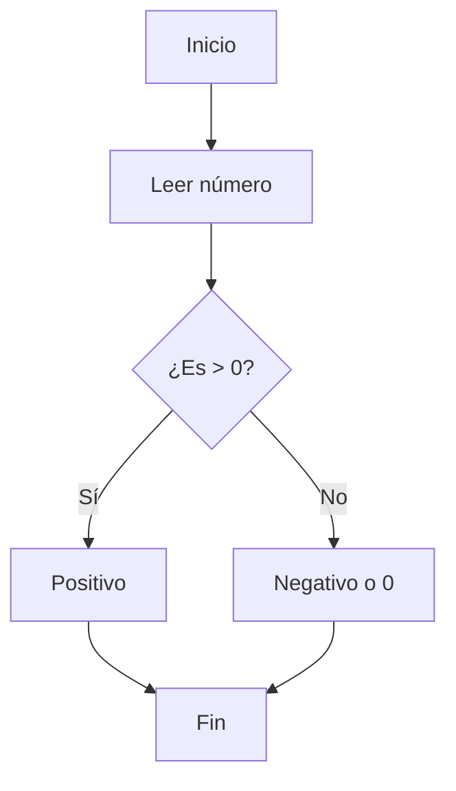

# Diseño de algoritmos

## ¿Qué es un algoritmo?

Se define algoritmo como un conjunto o secuencia de instrucciones bien definidas, ordenadas y finitas que permiten realizar una actividad o tarea determinada.

Los algoritmos tienen un estado inicial, con una o varias entradas y un estado final en el que se obtiene una solución. 

!!! abstract "Resumen"
    Un algoritmo es una **serie de pasos ordenados** que permiten resolver un problema.

!!! example "Ejemplo"
    Hacer un café:
    
    1. Calentar agua
    2. Añadir café
    3. Servir

---

## Características de un algoritmo

  - **No ambiguo** → Cada paso debe estar claramente definido  
  - **Preciso y ordenado** → El orden de ejecución es fundamental  
  - **Finito** → Debe terminar en un tiempo limitado  
  - **Número finito de pasos** → No puede haber infinitas instrucciones  
  - **Sin errores** → No deben faltar pasos ni existir incoherencias  
  - **Determinista** → Para las mismas entradas, produce siempre el mismo resultado  
  - **Independiente** → Puede implementarse en cualquier lenguaje de programación 

## Representación de algoritmos

Cuando queremos describir un algoritmo no siempre es viable representar todos los tipos de datos, instrucciones y expresiones, puesto que el proceso puede llegar a ser tedioso o inviable. 

A continuación, comentaremos algunas de las técnicas más útiles para definir y diseñar algoritmos.

### Lenguaje natural
Pese a la gran cantidad de inconvenientes que presenta el lenguaje natural, es necesario para simplemente plantear o calibrar el problema, en ningún caso debería utilizarse para describir completamente un algoritmo, puesto que este tipo de técnica es ambigua y no universal.

Ejemplo:

``
Leer número
Si es mayor que 0 → mostrar "positivo"
``

!!! warning "Limitación"
    El lenguaje natural puede dar lugar a interpretaciones distintas.

### Pseudocódigo
Por otro lado, el pseudocódigo, utiliza la capacidad de narración del lenguaje natural, aunque delimitando su uso, como se puede ver más adelante, en la Tabla 2, este tipo de técnica descriptiva elimina ambigüedades, es fácilmente comprensible, se adapta a cualquier lenguaje de programación y es muy compacto.

    Inicio
        Leer numero
        Si numero > 0 Entonces
            Escribir "Positivo"
        SiNo
            Escribir "No positivo"
    Fin

### Diagrama de flujo

Los diagramas de flujo pese a no ser tan compactos como el pseudocódigo transmiten mayor claridad visual, esta técnica representa además el flujo de datos mediante flechas y es ampliamente utilizada para realizar diseños en cualquier paradigma, aunque destaca en la programación grafica. 

## Diseño de algoritmos

Los algoritmos se diseñan en base a problemas, por tanto, es fundamental entender perfectamente el problema para distinguir correctamente que tipo de algoritmo debemos utilizar.

!!! danger "Importante"
    Un mal análisis del problema puede obligar a rehacer todo el algoritmo.

### Resolución de problemas
Para generar un algoritmo capaz de resolver un problema es recomendable seguir estos pasos:

  1. **Analizar el problema**
     Comprender qué se pide.
  2. **Definir entradas y salidas**
     Identificar los datos necesarios y los resultados esperados.
  3. **Diseñar el algoritmo**
     Usar pseudocódigo o diagramas de flujo.
  4. **Codificar**
     Implementar en un lenguaje de programación.
  5. **Probar y depurar**
     Detectar y corregir errores.
  6. **Ejecutar**
     Usar el programa de forma real.

Esta secuencia es especialmente efectiva y rápida de aplicar a problemas pequeños, pero ¿qué ocurre cuando tenemos un problema demasiado grande? La solución es fácil, simplemente dividimos el problema en subproblemas más pequeños. Esta técnica se le conoce como diseño descendente.

#### Diseño descendente
El diseño descendente es una técnica tan intuitiva que se utilizaba en todo el mundo incluso antes de sistematizarse. La técnica consiste en trabajar desde un nivel abstracto para dividir el problema en sus partes más esenciales. De esta forma, conseguimos descomponer problemas complejos en otros más simples y manejables.

Se representa como una cascada de nodos, siendo el primer nodo el nivel 0 y el más abstracto, este se descompone en cuantos niveles y nodos haga falta para describir de forma concreta la solución del problema. 

!!! question "Ejercicio de ejemplo"
    Diseña un algoritmo que calcule la **nota media de una clase**.
    
    **Pistas:**
        ¿Cuántos alumnos hay?
        ¿Qué datos necesitas?
        ¿Cómo se calcula la media?